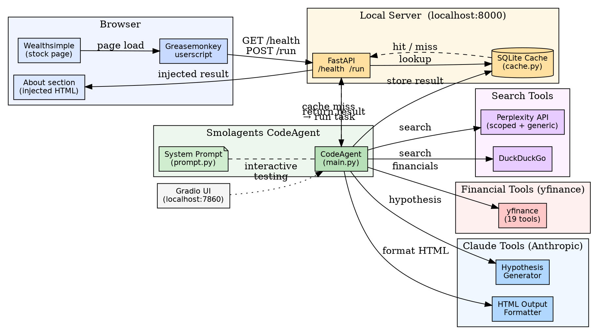

x`# Architecture — Wealthsimple Deepsearch Extension

An AI-powered financial research tool that injects a "Deep Research" button into the Wealthsimple web app and returns an LLM-generated company analysis.

---

## System Overview

```
Browser (Wealthsimple)
  └─ Greasemonkey Script
       ├─ Detects About section in shadow DOM
       ├─ Injects "Deep Research" button
       └─ POST /run → FastAPI Server
                          ├─ SQLite Cache hit? → return cached result
                          └─ Cache miss → Smolagents CodeAgent
                                              ├─ Gemini 2.0 Flash (orchestrator)
                                              ├─ 24 tools (search, yfinance, Claude)
                                              └─ Result → Cache → Browser
```

---

## Component Map

| Component | File(s) | Role |
|-----------|---------|------|
| Browser userscript | `wealthsimple_injector/grease_monkey.user.js` | DOM injection, health check, API calls |
| FastAPI server | `app/server.py` | HTTP entry point, cache orchestration |
| Gradio UI | `app/main.py` | Interactive testing interface |
| Agent setup | `app/main.py` | CodeAgent + LiteLLM model init |
| System prompt | `app/prompt.py` | Agent instructions + research workflow |
| Custom tools | `app/agent_tools.py` | Perplexity search, Claude hypothesis/formatting |
| Financial tools | `app/yfinance_tools.py` | 19 yfinance wrappers |
| Cache | `app/cache.py` | SQLite read/write by company name |

---

## Data Flow

1. **User** navigates to a Wealthsimple stock page.
2. **Greasemonkey script** polls `GET /health`; if online, injects a "Deep Research" button.
3. **User clicks** the button; script sends `POST /run` with `Company: {name}\nAbout: {text}`.
4. **FastAPI** extracts the company name, checks SQLite cache.
   - **Cache hit**: returns stored result immediately.
   - **Cache miss**: runs the agent.
5. **CodeAgent** (Gemini 2.0 Flash) executes multi-step reasoning using 24 tools:
   - Resolves the ticker via DuckDuckGo + Perplexity.
   - Fetches fundamentals, financials, and options via yfinance.
   - Runs domain-scoped web searches via Perplexity.
   - Generates research hypotheses and formats HTML output via Claude (Anthropic).
6. Result is **cached** in SQLite and returned as `{"result": "..."}`.
7. Script **injects HTML** into the About section of the page.

---

## Deployment Modes

| Mode | Command | Endpoint |
|------|---------|---------|
| Interactive UI | `make run-agent` | http://127.0.0.1:7860 (Gradio) |
| Headless API | `make run-server` | http://0.0.0.0:8000 (FastAPI) |

---

## API Surface

```
GET  /health          → {"status": "ok"}
POST /run             → {"task": "Company: ...\nAbout: ..."}
                      ← {"result": "<html or markdown>"}
```

---

## Environment Variables

| Variable | Required | Purpose |
|----------|----------|---------|
| `GOOGLE_API_KEY` | Yes | Gemini 2.0 Flash (main agent) |
| `PERPLEXITY_API_KEY` | Yes | Scoped web search |
| `ANTHROPIC_API_KEY` | Yes | Hypothesis generation + HTML formatting |
| `DEEPSEARCH_DB_PATH` | No | Custom SQLite cache path |

---

## Tools Available to the Agent (24 total)

### Search & Analysis (5)
- `scoped_perplexity_search` — domain/recency-filtered Perplexity search
- `generic_search` — general Perplexity search
- `DuckDuckGoSearchTool` — built-in DuckDuckGo search
- `generate_deep_research_hypothesis` — Claude-powered hypothesis generation
- `output_formatter` — Claude-powered HTML output formatting

### Financial Data via yfinance (19)
- Price: `ticker_history`, `ticker_download`
- Company: `ticker_info`, `ticker_calendar`, `ticker_sustainability`
- Dividends/Splits: `ticker_dividends`, `ticker_splits`
- Financials (annual + quarterly): `ticker_financials`, `ticker_quarterly_financials`
- Balance sheet (annual + quarterly): `ticker_balance_sheet`, `ticker_quarterly_balance_sheet`
- Cash flow (annual + quarterly): `ticker_cashflow`, `ticker_quarterly_cashflow`
- Recommendations: `ticker_recommendations`, `ticker_upgrades_downgrades`
- Ownership: `ticker_institutional_holders`
- Options: `ticker_options`, `ticker_option_chain`

---

## Cache Schema

```sql
CREATE TABLE deep_search_cache (
    cache_key  TEXT PRIMARY KEY,          -- lowercased company name
    result     TEXT NOT NULL,             -- raw agent output
    sec_id     TEXT,                      -- from page URL, e.g. sec-s-159a99834ea34fdbb66c05700828da52
    created_at TEXT NOT NULL DEFAULT (datetime('now'))
);
```

Cache has no TTL; results are stored indefinitely.

---

## DOT Graph



> Render with: `dot -Tsvg architecture.md` after extracting the DOT block, or paste into https://dreampuf.github.io/GraphvizOnline/

---

## Known Limitations

1. **Shadow DOM timing** — About section detection requires a page reload after the script installs.
2. **Tool utilisation** — Not all 24 tools are consistently called; output depth varies.
3. **No cache TTL** — Results never expire; stale data accumulates for long-lived companies.
4. **Anthropic rate limits** — Claude is used only for hypothesis generation and formatting; unsuitable as the primary orchestrator at current API tier limits.